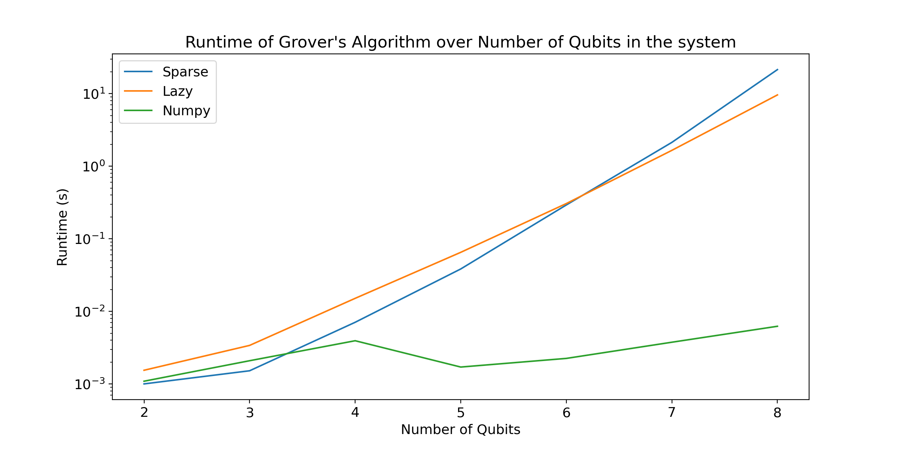

# Quantum Computing Project

This Project was created as part of the [Quantum Computing Course](http://www.drps.ed.ac.uk/20-21/dpt/cxphys10110.htm) at the University of Edinburgh. In this project, we create two different
implementations of quantum circuits which we use to explore [Grover’s
Algorithm](https://en.wikipedia.org/wiki/Grover%27s_algorithm).

The two implementations were created in order to test diifferent
techniques of creating this quantum algorithm and to test across each
other for parts that make the algorithm more efficient. We decided to
include both in our project because they employ different techniques and
helped us understand the algorithm from two different perspectives.

## The Implementations

The first implementation, **Circuit Builder**, is allowing the User to
build their own circuit on the go, create custom circuits and manually
code the algorithm needed. It explores the Grover’s algorithm both
numrically and geometrically as it can plot visually the results on a
given axis of rotation. It is using a Sparse and Lazy Matrices to make
computations as efficient as possible.

The second implementation, **Pre-Build Cricuits**, has predefined
circuits for the Grover algorithm and an example of the use of Quantum
Teleportation. It can visually show the probabilities of finding a state
as an animation and allows the User through prompts to explore Quantum
Teleportation by defining Alice’s and Bob’s states. It is not using a
SparseMatrix Implementation, instead it uses the numpy.kron library and
numpy.dot for its computations. We include a UML diagram for the
**Pre-Build Cricuits**:

## Usage

The UserDemo module runs all of our predefined circuits and checks of
the validity of our algorithms. It allows the User through prompts to
navigate through our programs and gives the option to run benchmark
tests. This includes benchmarks of how our two implementations compare
in runtime for grover, aswell as checks of the LazyMatrices,
SparseMatrices and Numpy arrays.

The User can run the Demo by the following command:

`python UserDemo.py`

## Documentation

For Documentation we used the [Sphinx](https://example.com) Auto-Documentation generator. One can access the documentation by the following command:

**UNIX:**
`open docs/_build/html/index.html`

## Sample Results

